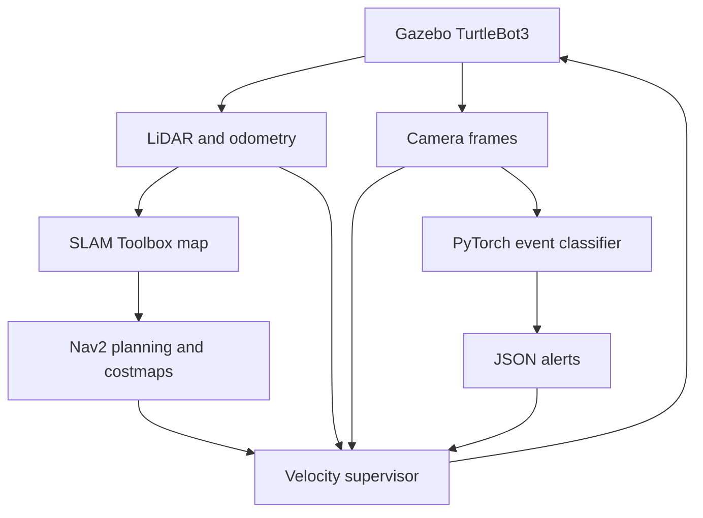

# Autonomous TurtleBot AI — simulation-first reconstruction

Rebuilt in October/2026 from my original graduation project.

**New AI-assisted reconstruction, not recovered original code or historical results.** This repository combines upstream TurtleBot3 simulation, SLAM Toolbox and Nav2 with a newly written velocity supervisor and PyTorch visual-alert pipeline. The recovered TurtleBot4 course team script is preserved separately; see [PROVENANCE.md](PROVENANCE.md).

**Validation status:** offline tests and live ROS2 message/alert checks passed. The ROS2/Gazebo launch is provided, but full simulation was **not validated here**: Gazebo Transport failed while enumerating network interfaces (`getifaddrs`) in the restricted execution environment. Mapping and autonomous navigation remain to be verified on an ordinary Ubuntu host.

## Implemented components

- TurtleBot3 **Waffle Pi** in Gazebo Harmonic with ROS2 Jazzy: camera, LiDAR, odometry and an occupancy map.
- SLAM Toolbox mapping and Nav2 path planning, local costmaps and obstacle avoidance.
- A separate supervisor gates navigation commands, stops on stale camera/laser data and nearby obstacles, and latches visual alerts until manually reset.
- A small **newly trained smoke checkpoint** from a public D-Fire subset, with camera classification and JSON alerts.
- A temporal CNN/GRU training and inference implementation for eight-frame video clips. **A real violence detector is not trained or included:** the proposed RWF-2000 source currently withholds downloads. Synthetic clips validate the software path only.

This is a portfolio demonstrator. The smoke baseline misses many events, and the supervisor does not cover a complete robot footprint or every failure mode. It is unsuitable for unattended safety or surveillance decisions. No hardware testing or production deployment is claimed.

## Architecture



### Design choices you can discuss

- **Use upstream SLAM and navigation:** SLAM Toolbox estimates the map and pose; Nav2 plans paths and controls motion. Reusing these tested components leaves clear space for application logic. Their algorithms are not claimed as code written here.
- **Decision-level camera/LiDAR fusion:** laser clearance and camera freshness/alerts jointly affect the velocity gate. This is not calibrated geometric fusion, camera depth estimation or 3D obstacle reconstruction.
- **Separate command topics:** Nav2 outputs `/cmd_vel_nav`; only the supervisor publishes robot `/cmd_vel`. The launch uses stamped velocity messages for the pinned Jazzy TurtleBot3 configuration. This separation makes the gate observable and testable.
- **Wall-clock watchdogs:** sensor receipt and command age use a monotonic clock, so a paused simulation cannot leave a command considered fresh forever. Receipt freshness does not detect every delayed or repeated frame.
- **Explicit alert latch:** three consecutive classifier scores at least 0.5 emit an active alert; the supervisor remains stopped until reset. The threshold is a baseline choice, not calibrated confidence or a guaranteed false-alarm rate.
- **Small CNN plus GRU:** each 64×64 RGB frame becomes a spatial feature vector. A GRU summarizes a sequence; smoke uses one frame and the video path uses eight. This keeps CPU inference small, at the cost of fine visual detail.
- **Split before training:** manifests define train/validation/test and source groups. Duplicate media bytes and groups shared between splits are rejected. Best epoch is selected by validation macro F1; test data is evaluated after selection.

## Stack and sources

Python 3.12, ROS2 Jazzy, Gazebo Harmonic, TurtleBot3 Waffle Pi, SLAM Toolbox, Nav2, OpenCV, PyTorch, scikit-learn and pytest. Target OS: Ubuntu 24.04. No Firebase, cloud API or credentials are required.

| Component | Source | Terms |
|---|---|---|
| New code and small checkpoint | This reconstruction | MIT |
| TurtleBot3 simulation and `config/nav2.yaml` | [ROBOTIS](https://github.com/ROBOTIS-GIT/turtlebot3_simulations) | Apache 2.0; config license included |
| D-Fire images/labels | [GAIA authors](https://github.com/gaia-solutions-on-demand/DFireDataset), [author-linked Kaggle mirror](https://www.kaggle.com/datasets/sayedgamal99/smoke-fire-detection-yolo) | Collection published under CC0 1.0; originals remain local |
| Proposed RWF-2000 videos | [Cheng, Cai and Li](https://github.com/mchengny/RWF2000-Video-Database-for-Violence-Detection) | Restricted; no redistribution/modification/commercial use without approval; downloads currently withheld |

D-Fire credit: Pedro Vinícius Almeida Borges de Venâncio, Adriano Chaves Lisboa and Adriano Vilela Barbosa, *An automatic fire detection system based on deep convolutional neural networks for low-power, resource-constrained devices*, Neural Computing and Applications (2022).

RWF-2000 credit: Ming Cheng, Kunjing Cai and Ming Li, *RWF-2000: An Open Large Scale Video Database for Violence Detection*, ICPR (2021), DOI 10.1109/ICPR48806.2021.9412502. No mirrored videos with conflicting license claims were used.

## ROS2/Gazebo setup

Install ROS2 Jazzy using the [official Ubuntu guide](https://docs.ros.org/en/jazzy/Installation/Ubuntu-Install-Debs.html), then:

```bash
sudo apt install ros-jazzy-ros-base ros-jazzy-ros-gz ros-jazzy-turtlebot3 \
  ros-jazzy-turtlebot3-msgs ros-jazzy-slam-toolbox ros-jazzy-navigation2 \
  ros-jazzy-nav2-bringup python3-colcon-common-extensions python3-venv
source /opt/ros/jazzy/setup.bash
mkdir -p ~/tb3_ws/src
cd ~/tb3_ws/src
git clone -b jazzy https://github.com/ROBOTIS-GIT/turtlebot3_simulations.git
git -C turtlebot3_simulations checkout 45633014a14e8f438495b532a723e4ad45cbbd31
git clone https://github.com/adhamamerrrr/autonomous-turtlebot-ai.git
cd ~/tb3_ws
/usr/bin/python3 -m venv --system-site-packages .venv
source .venv/bin/activate
python -m pip install torch --index-url https://download.pytorch.org/whl/cpu
python -m pip install -r src/autonomous-turtlebot-ai/requirements.txt
python /usr/bin/colcon build --symlink-install --cmake-args -DPython3_EXECUTABLE=/usr/bin/python3
source install/setup.bash
ros2 launch autonomous_turtlebot_ai sim.launch.py
```

The default launch runs Gazebo headless. Gazebo's first run downloads upstream ground-plane and sun assets. Use `gz sim -g` in another terminal if you have a desktop and want its GUI. The package includes its newly trained 229 KiB smoke checkpoint; original model weights are not recovered. Violence detection reports disabled rather than silently pretending to predict no events.

Open a second terminal, source ROS2, the virtual environment and workspace, then:

```bash
cd ~/tb3_ws/src/autonomous-turtlebot-ai
python scripts/check_sim.py
ros2 topic echo /portfolio/alerts
```

`check_sim.py` observes sensor topics and the map, sends a short relative navigation goal and asserts success. Run it in a clear initial world; it is not a comprehensive navigation benchmark. For manual goals use RViz/Nav2 or a `NavigateToPose` action. Mapping requires motion; this reconstruction does not implement autonomous frontier exploration.

Save your generated map:

```bash
mkdir -p maps
ros2 run nav2_map_server map_saver_cli -f maps/demo
```

Reset a latched alert after inspecting the cause:

```bash
ros2 service call /portfolio/reset_alert std_srvs/srv/Trigger '{}'
```

For a separately trained video model:

```bash
ros2 launch autonomous_turtlebot_ai sim.launch.py violence_model:=/absolute/path/violence.pt
```

## Reproduce smoke training

The downloader retrieves approximately 3 GB of public images but extracts only the selected subset. Keep the archive and media out of git.

```bash
cd ~/tb3_ws/src/autonomous-turtlebot-ai
python scripts/prepare_dfire.py
python -m autonomous_turtlebot_ai.train --task smoke \
  --manifest data/dfire-small/manifest.csv --data-root data/dfire-small \
  --output models/smoke --epochs 15 \
  --source https://www.kaggle.com/datasets/sayedgamal99/smoke-fire-detection-yolo
python scripts/predict_smoke.py /path/to/an/image.jpg --model models/smoke/smoke.pt
```

The helper preserves the mirror's split membership and samples 200 examples per class for training and 50 per class for validation and test, seed 42. YOLO class 0 is smoke, verified against the archive's `data.yaml`; a fire-only image is negative **for smoke**, not a safe scene. Exact byte duplicates selected across splits are removed. Original scene/video grouping is unavailable, so correlated scenes can still inflate results. Labels are image-level presence, not bounding-box localization.

`results/smoke_manifest.csv`, media hashes, archive fingerprint and training history make the measured run inspectable. Reproducibility depends on the recorded archive version; a changed mirror can change results. No large images or datasets are committed.

## Video training path

Obtain an appropriately licensed public video dataset from its authorized source. The current RWF-2000 access restriction is a concrete blocker for that dataset. No credentials, student IDs or private footage belong in this repo.

Create a CSV with `path,label,split,group`: relative video path; 0 negative/1 event; `train`, `val` or `test`; original source-video group. Keep every clip from one source in one split. Both classes must exist in each split. The loader samples eight evenly spaced frames from each video; it caches decoded tensors in memory, so use a bounded subset initially.

```bash
python -m autonomous_turtlebot_ai.train --task violence --manifest manifest.csv \
  --data-root /path/to/public/clips --output models/violence --epochs 15 \
  --source https://the-authorized-dataset-source
```

Offline training samples cover a whole clip; live inference uses the latest eight frames at roughly 5 Hz. This temporal-distribution difference must be evaluated before claiming useful live detection.

## Tests and observed results

```bash
PYTHONPATH=. pytest -q
PYTHONPATH=. python scripts/offline_demo.py
PYTHONPATH=. python scripts/check_video_training.py
# Live ROS2 graph checks use separate domains from the running Gazebo demo:
ROS_DOMAIN_ID=43 python scripts/check_ros_gate.py
ROS_DOMAIN_ID=44 python scripts/check_model_alert.py
```

The standalone offline tests and synthetic demos can run in a regular Python virtual environment after installing `requirements.txt` and `pip install -e .`; ROS2 is needed only for the ROS graph and simulation checks.

**Measured smoke baseline:** 400 train / 100 validation / 100 test images, balanced by smoke presence; 15 CPU training epochs, best epoch by validation macro F1. On the 100 held-out test images at threshold 0.5: **accuracy 0.66**, **macro F1 0.6511**, **smoke recall 0.50**. These are new reconstruction results, not original university results. Full outputs are in `results/smoke_results.json`.

**Offline validation:** 14 tests passed for velocity gating, malformed/stale input, checkpoint shape/loading and split leakage checks. The synthetic AVI test executed decoding, training, checkpoint save/load and inference; it provides **no real violence-detection result**. The live ROS2 gate check passed clear-command, obstacle-stop and latched-alert scenarios. The trained checkpoint produced an alert after three positive predictions on a selected validation-image replay; this is an integration check, not a new accuracy result. The two ROS packages built with colcon. Full Gazebo execution failed at network-interface enumeration; no simulation success is claimed. See `results/validation.json` and `results/model_alert_check.json`.

## Limitations / Future work

- No real violence model or authorized RWF-2000 media; no original graduation code, maps, datasets or weights recovered.
- Smoke recall is only 50% on this small test subset. A negative prediction is not evidence that no smoke exists. Improve with a larger, source-grouped dataset, higher-resolution backbone and independently chosen operating thresholds.
- Three-positive smoothing trades response delay for fewer isolated alerts. Probabilities are uncalibrated. No end-to-end latency guarantee is established by a model-only timing run.
- Decision-level fusion only; no camera/LiDAR calibration, geometric projection or visual SLAM.
- The extra gate checks front/rear sectors and receipt age, not a full swept footprint, braking distance, detector health, transport latency or all obstacles. Nav2 costmaps remain essential.
- The detector uses blocking CPU inference in its own ROS node. It needs bounded queues, profiling and a health watchdog for more demanding use.
- Full Gazebo mapping/navigation is unverified in this environment. The provided short-goal smoke check must pass on a suitable host; even that cannot establish robust navigation or hardware safety.
- No autonomous exploration, mission management, human-reviewed alert UI or secure multi-user service is included.
